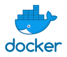

## Amazon SageMaker Local Mode Examples
   

This repository contains examples and related resources showing you how to preprocess, train, debug your training script with breakpoints, and serve on your local machine using Amazon SageMaker Local mode for processing jobs, training and serving. 

## Overview

The local mode in the Amazon SageMaker Python SDK can emulate CPU (single and multi-instance) and GPU (single instance) SageMaker training jobs by changing a single argument in the TensorFlow, PyTorch or MXNet estimators.  To do this, it uses Docker compose and NVIDIA Docker.  It will also pull the Amazon SageMaker TensorFlow, PyTorch or MXNet containers from Amazon ECS, so you’ll need to be able to access a public Amazon ECR repository from your local environment.

For full details on how this works:

- Read the Machine Learning Blog post at: https://aws.amazon.com/blogs/machine-learning/use-the-amazon-sagemaker-local-mode-to-train-on-your-notebook-instance/

## SageMaker local mode training and serving in PyCharm
This repository examples will work in any IDE on your local machine. 

Here you can see a TensorFlow example running on PyCharm. **The data for training and serving is also located on your local machine file system**.

#### SageMaker local mode training in PyCharm

#### SageMaker local mode serving in PyCharm

#### SageMaker local mode processing jobs in PyCharm

#### Debugging your training script running SageMaker local mode training in PyCharm

### Repository Structure

The repository contains the following resources:

- **scikit-learn resources:**  

  - [**scikit-learn Script Mode Training and Serving**](scikit_learn_script_mode_local_training_and_serving):  This example shows how to train and serve your model with scikit-learn and SageMaker script mode, on your local machine using SageMaker local mode.
  - [**scikit-learn Bring Your Own Model**](scikit_learn_bring_your_own_model_local_serving):  This example shows how to serve your pre-trained scikit-learn model with SageMaker, on your local machine using SageMaker local mode.
  - [**Gensim Word2Vec Bring Your Own Model**](gensim_with_word2vec_model_artifacts_local_serving):  This example shows how to serve your pre-trained Word2Vec model, trained using BlazingText algorithm with SageMaker, and gensim for inference, on your local machine using SageMaker local mode.
  - [**CatBoost with scikit-learn Script Mode Training and Serving**](catboost_scikit_learn_script_mode_local_training_and_serving):  This example shows how to train and serve a CatBoost model with scikit-learn and SageMaker script mode, on your local machine using SageMaker local mode.
  - [**Delta Sharing scikit-learn Script Mode Training and Serving**](delta_sharing_scikit_learn_local_training_and_serving):  This example shows how to train a scikit-learn model on the boston-housing dataset fetched from Delta Lake using Delta Sharing, and then serve your model with scikit-learn and SageMaker script mode, on your local machine using SageMaker local mode.

- **XGBoost resources:**  

  - [**XGBoost Script Mode Training and Serving**](xgboost_script_mode_local_training_and_serving):  This example shows how to train and serve your model with XGBoost and SageMaker script mode, on your local machine using SageMaker local mode.

- **TensorFlow resources:**  

  - [**TensorFlow Script Mode Training and Serving**](tensorflow_script_mode_local_training_and_serving):  This example shows how to train and serve your model with TensorFlow and SageMaker script mode, on your local machine using SageMaker local mode.
  - [**TensorFlow Script Mode Debug Training Script**](tensorflow_script_mode_debug_local_training):  This example shows how to debug your training script running inside a prebuilt SageMaker Docker image for TensorFlow, on your local machine using SageMaker local mode.
  - [**TensorFlow Script Mode Deploy a Trained Model and inference on file from S3**](tensorflow_script_mode_local_model_inference):  This example shows how to deploy a trained model to a SageMaker endpoint, on your local machine using SageMaker local mode, and inference with a file in S3 instead of http payload for the SageMaker Endpoint.
  - [**TensorFlow Script Mode Training and Batch Transform**](tensorflow_script_mode_california_housing_local_training_and_batch_transform):  This example shows how to train your model and run Batch Transform job with TensorFlow and SageMaker script mode, on your local machine using SageMaker local mode.
  - [**TensorFlow extend AWS TensorFlow Deep Learning Container Image**](tensorflow_extend_dlc_california_housing_local_training):  In this example we show how to package a TensorFlow container, extending the SageMaker TensorFlow container, with a Python example which works with the California Housing dataset. By extending the SageMaker TensorFlow container we can utilize the existing training solution made to work on SageMaker, leveraging SageMaker TensorFlow `Estimator` object, with `entry_point` parameter, specifying your local Python source file which should be executed as the entry point to training. To make it work, we replace the `framework_version` and `py_version` parameters, with `image_uri` of the Docker Image we have created.  

- **PyTorch resources:**  

  - [**PyTorch Script Mode Training and Serving**](pytorch_script_mode_local_training_and_serving):  This example shows how to train and serve your model with PyTorch and SageMaker script mode, on your local machine using SageMaker local mode.
  - [**PyTorch Script Mode Deploy a Trained Model**](pytorch_script_mode_local_model_inference):  This example shows how to deploy a trained model to a SageMaker endpoint, on your local machine using SageMaker local mode, and serve your model with the SageMaker Endpoint.
  - [**Deploy a pre-trained PyTorch HeBERT model from Hugging Face on Amazon SageMaker Endpoint**](huggingface_hebert_sentiment_analysis_local_serving):  This example shows how to deploy a pre-trained PyTorch HeBERT model from Hugging Face, on Amazon SageMaker Endpoint, on your local machine using SageMaker local mode.
  
- **Bring Your Own Container Training resources:**  

  - [**Bring Your Own Container TensorFlow Algorithm - Train/Serve**](tensorflow_bring_your_own_california_housing_local_training_and_serving):  This example provides a detailed walkthrough on how to package a Tensorflow 2.5.0 algorithm for training and production-ready hosting. We have included also a Python file for local training and serving that can run on your local computer, for faster development.
  - [**Bring Your Own Container TensorFlow Algorithm - Train/Batch Transform**](tensorflow_bring_your_own_california_housing_local_training_and_batch_transform):  This example provides a detailed walkthrough on how to package a Tensorflow 2.5.0 algorithm for training, and then run a Batch Transform job on a CSV file. We have included also a Python file for local training and serving that can run on your local computer, for faster development.
  - [**Bring Your Own Container TensorFlow Algorithm - Serve without TensorFlow Serving**](tensorflow_bring_your_own_california_housing_local_serving_without_tfs):  This example provides a detailed walkthrough on how to package a Tensorflow 2.5.0 algorithm for production-ready hosting without TensorFlow Serving. We have included also a Python file for local serving that can run on your local computer, for faster development.
  - [**Bring Your Own Container CatBoost Algorithm**](catboost_bring_your_own_container_local_training_and_serving):  This example provides a detailed walkthrough on how to package a CatBoost algorithm for training and production-ready hosting. We have included also a Python file for local training and serving that can run on your local computer, for faster development.    
  - [**Bring Your Own Container LightGBM Algorithm**](lightgbm_bring_your_own_container_local_training_and_serving):  This example provides a detailed walkthrough on how to package a LightGBM algorithm for training and production-ready hosting. We have included also a Python file for local training and serving that can run on your local computer, for faster development.
  - [**Bring Your Own Container Prophet Algorithm**](prophet_bring_your_own_container_local_training_and_serving):  This example provides a detailed walkthrough on how to package a Prophet algorithm for training and production-ready hosting. We have included also a Python file for local training and serving that can run on your local computer, for faster development.
  - [**Bring Your Own Container HDBSCAN Algorithm**](hdbscan_bring_your_own_container_local_training):  This example provides a detailed walkthrough on how to package a HDBSCAN algorithm for training. We have included also a Python file for local training that can run on your local computer, for faster development.
  - [**Bring Your Own Container scikit-learn Algorithm and deploy a pre-trained Model**](scikit_learn_bring_your_own_container_and_own_model_local_serving):  This example provides a detailed walkthrough on how to package a scikit-learn algorithm for serving with a pre-trained model. We have included also a Python file for local serving that can run on your local computer, for faster development.
  - [**Delta Lake Bring Your Own Container CatBoost Algorithm**](delta_lake_bring_your_own_container_local_training_and_serving):  This example provides a detailed walkthrough on how to package a CatBoost algorithm for training on data fetched from Delta Lake, directly from S3, and then serve your model with the Docker image you have built. We have included also a Python file for local training and serving that can run on your local computer, for faster development.  

- **Built-in scikit-learn Processing resources:**  

  - [**Built-in scikit-learn Processing Job**](scikit_learn_local_processing):  This example provides a detailed walkthrough on how to use the built-in scikit-learn Docker image for processing jobs. We have included also a Python file for processing jobs that can run on your local computer, for faster development.

- **Bring Your Own Container Processing resources:**  

  - [**Bring Your Own Container scikit-learn Processing Job**](scikit_learn_bring_your_own_container_local_processing):  This example provides a detailed walk-through on how to package a scikit-learn Docker image for processing jobs. We have included also a Python file for processing jobs that can run on your local computer, for faster development.
  - [**Delta Sharing Bring Your Own Container Processing Job**](delta_sharing_bring_your_own_container_local_processing):  This example provides a detailed walk-through on how to package a scikit-learn Docker image for processing job that fetch data from a table on Delta Lake using Delta Sharing, and aggregate total COVID-19 cases per country. We have included also a Python file for processing jobs that can run on your local computer, for faster development.
  - [**Dask Bring Your Own Container Processing Job**](dask_bring_your_own_container_local_processing):  This example provides a detailed walk-through on how to package a Dask Docker image for processing job that fetch JSON file from a website, and outputs the filenames found. We have included also a Python file for processing jobs that can run on your local computer, for faster development.
    
**Note**: Those examples were tested on macOS and Linux.

### Installation Instructions

1. [Create an AWS account](https://portal.aws.amazon.com/gp/aws/developer/registration/index.html) if you do not already have one and login.

2. Install [Docker Desktop for Mac](https://hub.docker.com/editions/community/docker-ce-desktop-mac)

3. [Install the AWS CLI](https://docs.aws.amazon.com/cli/latest/userguide/install-cliv2-mac.html#cliv2-mac-install-gui) and [Configure AWS credentials](https://docs.aws.amazon.com/cli/latest/userguide/cli-configure-quickstart.html#cli-configure-quickstart-config).

4. Clone the repo onto your local development machine using `git clone`.

5. Open the project in any IDE of your choice in order to run the example Python files.

6. Follow the instructions on which Python packages to install in each of the example Python file.

## Questions?

Please contact [@e_sela](https://twitter.com/e_sela) or raise an issue on this repo.

## License

This library is licensed under the MIT-0 License. See the LICENSE file.
