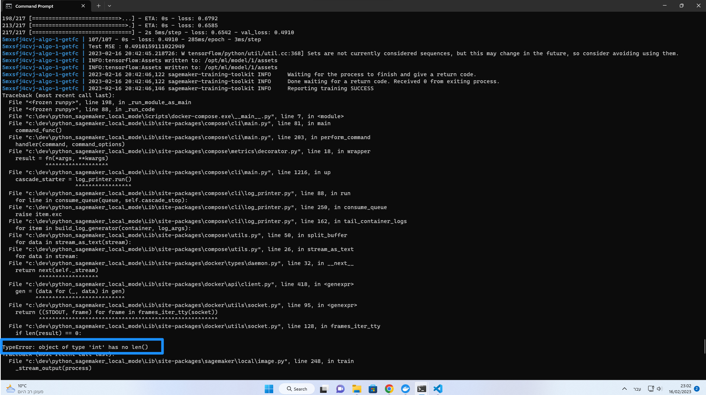
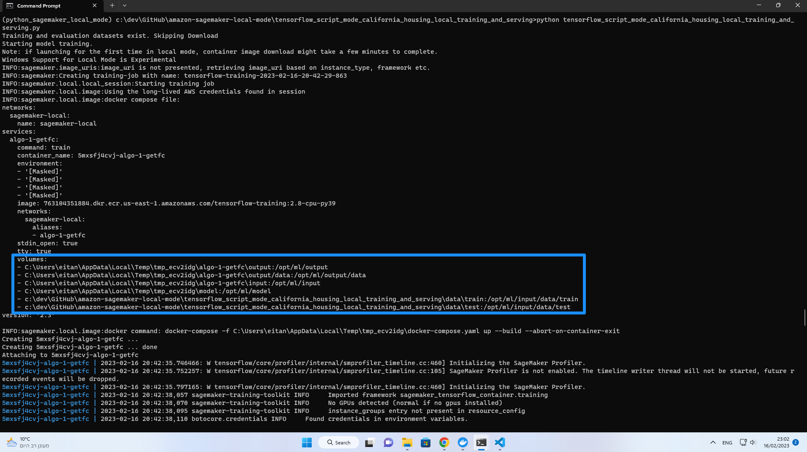
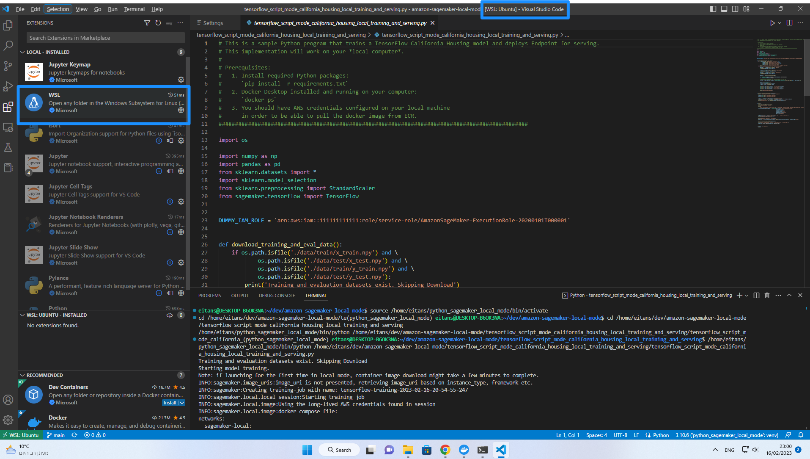
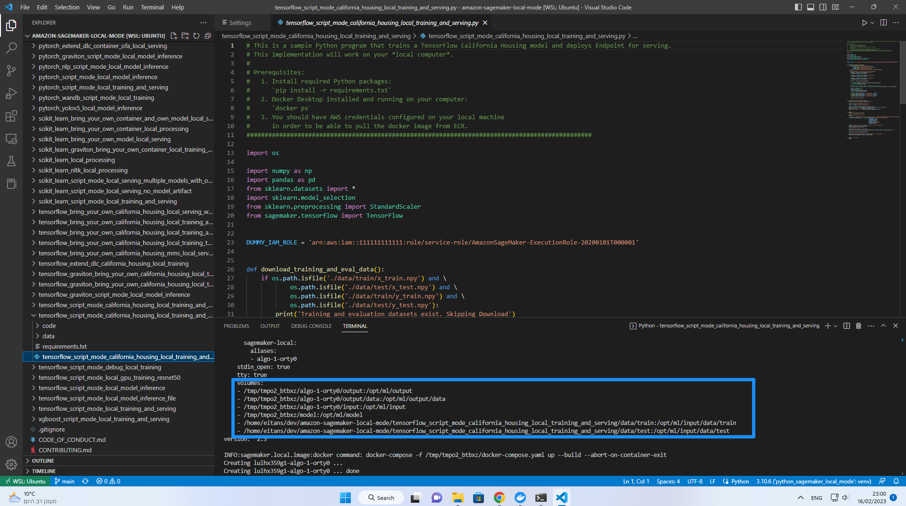

# SageMaker Local Mode on Windows

SageMaker Local Mode will not work on Windows unless you install WSL 2 and then, a Linux distro (Ubuntu is the default).

If you try to run the examples in this repo, you'll eventually get `TypeError: object of type 'int' has no len()` error after completing the training job.

The problem is because of failures to output the model on temporary folders created for the training job by SageMaker Local, and are related to Windows directory structure/permissions. 

### Installation Instructions for Windows and Visual Studio Code

1. Install [Docker Desktop for Windows](https://docs.docker.com/desktop/install/windows-install/).
2. Install [Linux on Windows with WSL](https://learn.microsoft.com/en-us/windows/wsl/install). We assume you install the default Ubuntu distro.
3. Once installed, you can search for Ubuntu in your Windows search bar.
4. Once Ubuntu has finished its initial setup you will need to create a username and password (this does not need to match your Windows user credentials).
5. Finally, it’s always good practice to install the latest updates with the following commands, entering your password when prompted. Execute: `sudo apt update` Press Y when prompted. 
6. Clone this GitHub repository: `git clone https://github.com/aws-samples/amazon-sagemaker-local-mode`
8. Open Visual Studio Code and install the [WSL Extension](https://marketplace.visualstudio.com/items?itemName=ms-vscode-remote.remote-wsl)

10. In Visual Studio Code: Choose `File` -> `Open Folder` and open the `amazon-sagemaker-local-mode` folder located on Ubuntu, you just cloned in previous step.
11. Once you run a sample code, you'll see that the temporary folders created for the training job by SageMaker Local, are now of Linux format, using WSL2. You should see `[WSL:Ubuntu]` in the upper bar of the Visual Studio Code window.

