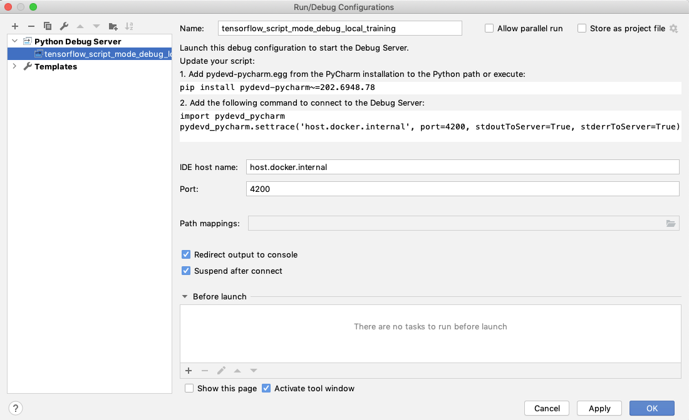
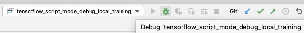
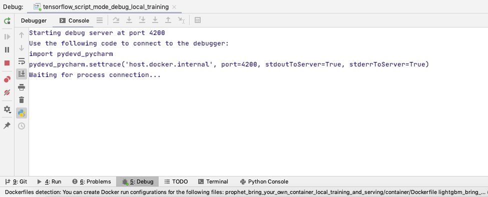
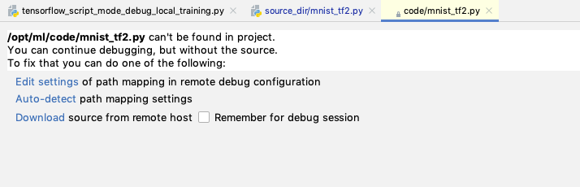
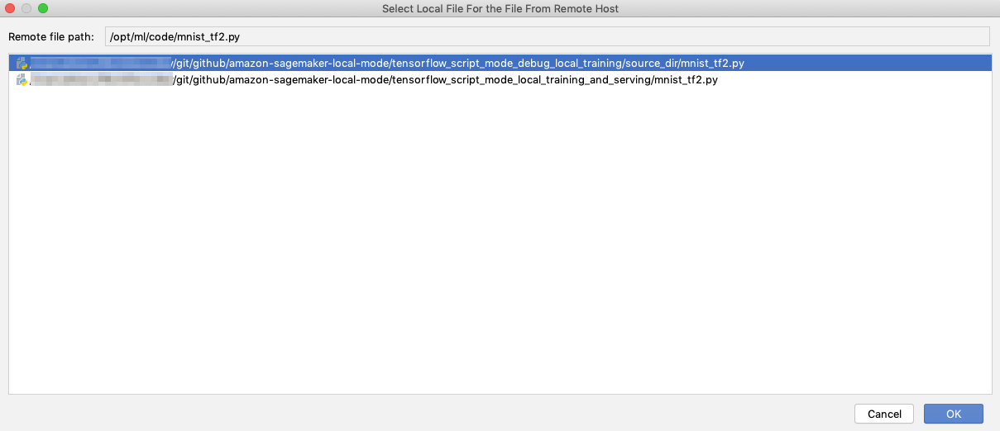
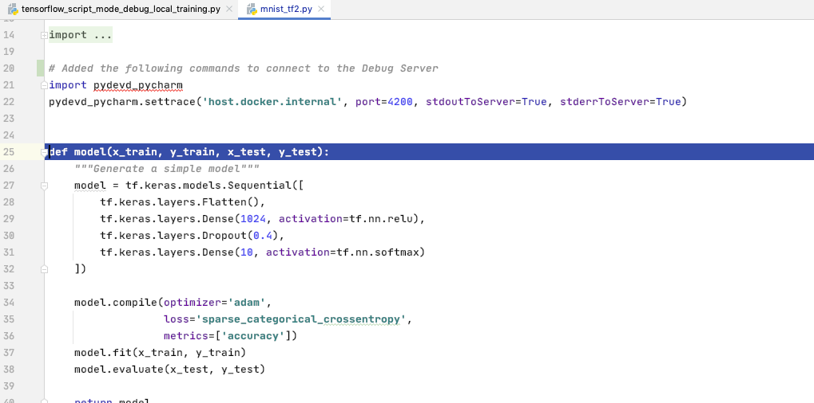
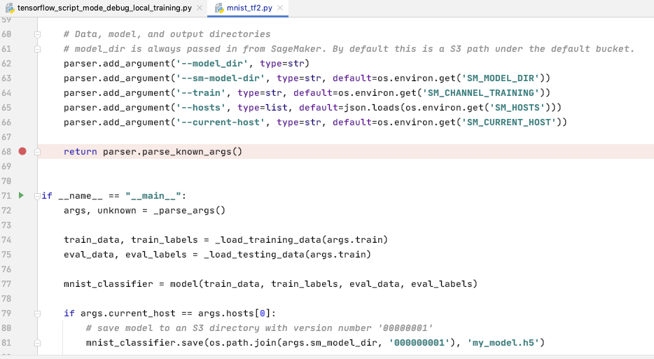
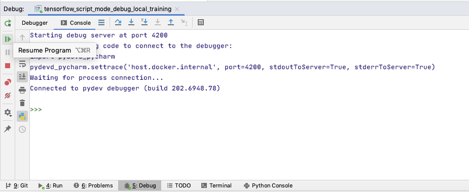
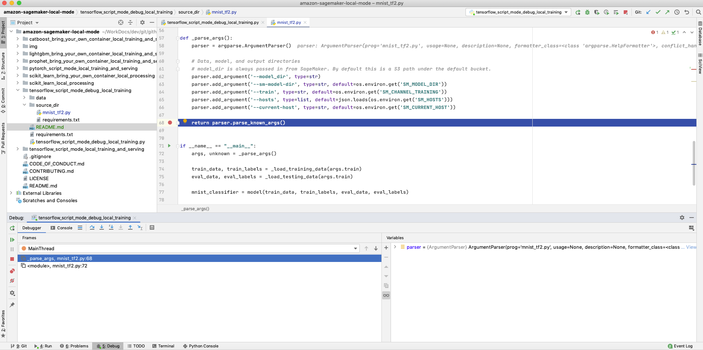
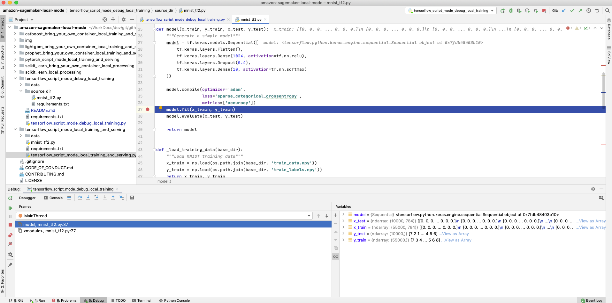

## Debug SageMaker Local Mode TensorFlow Training

This example demonstrates how you can debug a TensorFlow Training script running inside a prebuilt SageMaker Docker image for TensorFlow. 

## Overview

Debugging a running Docker container in PyCharm is possible using Remote debugging with the Python remote debug server configuration.
For more details, please refer to the [PyCharm documentation](https://www.jetbrains.com/help/pycharm/remote-debugging-with-product.html#remote-debug-config).    

### Steps required to debug a TensorFlow Training script running inside a prebuilt SageMaker Docker image for TensorFlow
Please follow the steps described below 

#### Create a run/debug configuration
From the main menu, choose Run| Edit Configuration.... The Run/debug configurations dialog opens. You have to click Add configuration on the toolbar, and from the list of available configurations, select Python Debug Server.

Enter the name of this run/debug configuration - let it be tensorflow_script_mode_debug_local_training. Specify the port number (here 4200) and the IDE host name (here host.docker.internal)  which resolves to the internal IP address used by the host. These parameters will be used by the remote TensorFlow training script.


#### Add `pydevd-pycharm` dependency

The `mnist_tf2.py` script will call `pydevd-pycharm` dependency, therefore, you can see a `requirements.txt` in the same folder, containing this dependency.

Using `source_dir` parameter in the `TensorFlow` Estimator, SageMaker SDK will detect a `requirements.txt`, and will install `pydevd-pycharm` on the container before calling the `mnist_tf2.py` script. 

#### Add the following commands to connect to the Debug Server 
Add the following commands in `mnist_tf2.py` script:
```
import pydevd_pycharm
pydevd_pycharm.settrace('host.docker.internal', port=4200, stdoutToServer=True, stderrToServer=True)
```
This will enable the TensorFlow script running within the Docker container to connect to the Debug Server.

#### Launch the Debug Server
Choose the created run/debug configuration, and click 


Next, You'll see a `Waiting for process connection...` message


#### Run the SageMaker TensorFlow local training script
Browse to the `tensorflow_script_mode_debug_local_training.py` file and run it.

Look at the output of the Run, you'll be able to see the following lines, indicating installation of `pydevd-pycharm`


#### Map the code in the container to the code in your project

You will see the following message, indicating that the code int he container can't be mapped to the code in your project.


click on `Auto-detect`, choose the `mnist_tf2.py` file in your project path, and click OK


Now you should see the `mnist_tf2.py` code



#### Set breakpoints and start debugging

Now you are almost ready to debug.

Set a breakpoint on the following line:
```
return parser.parse_known_args()
```
In this way, you'll be able to debug the arguments passed by SageMaker SDK.


#### Navigate to the Debug tool window and resume program

In order to resume the program and stop on the breakpoint you set earlier, navigate to the Debug tool window, and choose `Resume Program` 


#### Debug your application

Your code is actually executed on the Docker container, but debugged on the local machine.


Here you can see a breakpoint before actually running `model.fit` command

